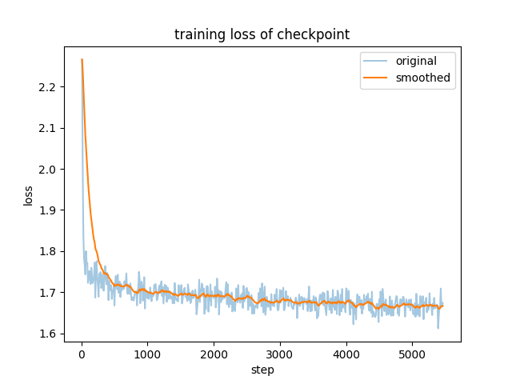

# llama_factory_demo
For NLP course

# Reference
@article{lightman2023let,   
  title={Let's Verify Step by Step},   
  author={Lightman, Hunter and Kosaraju, Vineet and Burda, Yura and Edwards, Harri and Baker, Bowen and Lee, Teddy and Leike, Jan and Schulman, John and Sutskever, Ilya and Cobbe, Karl},   
  journal={arXiv preprint arXiv:2305.20050},   
  year={2023}   
}

@inproceedings{volske2017tl,   
  title={Tl; dr: Mining reddit to learn automatic summarization},   
  author={V{\"o}lske, Michael and Potthast, Martin and Syed, Shahbaz and Stein, Benno},   
  booktitle={Proceedings of the Workshop on New Frontiers in Summarization},   
  pages={59--63},   
  year={2017}   
} 
